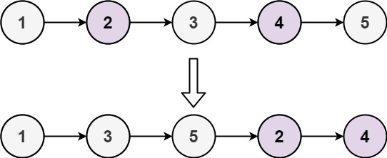

# 奇偶链表

## 题目：
给定单链表的头节点 head ，将所有索引为奇数的节点和索引为偶数的节点分别分组，
保持它们原有的相对顺序，然后把偶数索引节点分组连接到奇数索引节点分组之后，返回重新排序的链表
第一个节点的索引被认为是 奇数 第二个节点的索引为 偶数 以此类推


## 题目分析：
按照奇偶拆分链表后合并

## 代码：
- CPP
```
ListNode *oddEvenList(ListNode *head){
    if(head==nullptr){
        return nullptr;
    }
    ListNode *even=head,*odd=head->next;
    ListNode *newhead=odd;
    while(odd!=nullptr&&odd->next!=nullptr){
        even->next=odd->next;
        even=even->next;
        odd->next=even->next;
        odd=odd->next;
    }
    even->next=newhead;
    return head;
}
```
- PY
```
from typing import Optional

class ListNode:
    def __init__(self, val=0, next=None):
        self.val = val
        self.next = next

def oddEvenList(head: Optional[ListNode]) -> Optional[ListNode]:
    if not head:
        return None
    
    even = head
    odd = head.next
    newhead = odd
    
    while odd and odd.next:
        even.next = odd.next
        even = even.next
        odd.next = even.next
        odd = odd.next
        
    even.next = newhead
    return head
```